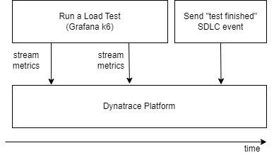

This demo will run a [Grafana k6](https://k6.io){target=_blank} script and use the [Dynatrace output plugin](https://www.dynatrace.com/hub/detail/grafana-k6){target=_blank} to stream metrics to Dynatrace.

## Logical Architecture

Below is the "flow" of information and actors during this demo.

This architecture also holds true for other load testing tools (eg. JMeter).

!!! tip

    This can (and should be) extended as demonstrated in the [release validation Observability Lab](https://dt-url.net/obslab-release-validation){target=_blank})
    to include the ability to trigger automated deployment checks.

1. A load test is executed.
The HTTP requests are annotated with [the standard header values](https://docs.dynatrace.com/docs/platform-modules/automations/cloud-automation/test-automation#tag-tests-with-http-headers){target=_blank}.

1. Metrics are streamed during the load test (if the load testing tool supports this)
or the metrics are send at the end of the load test.

1. The load testing tool is responsible for sending an SDLC event to signal "test is finished".
Integrators are responsible for crafting this event to contain any important information required by Dynatrace
such as the test duration.

## Compatibility

| Deployment         | Tutorial Compatible |
|--------------------|---------------------|
| Dynatrace Managed  | ✔️                 |
| Dynatrace SaaS     | ✔️                 |

- [Click Here to Begin :octicons-arrow-right-24:](getting-started.md)

