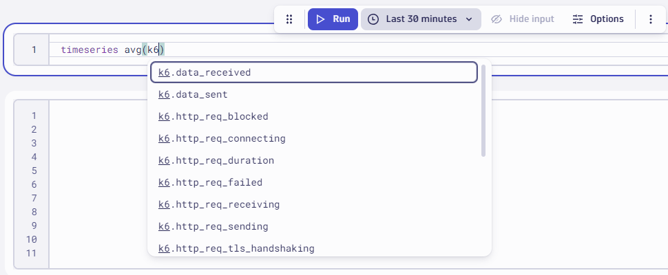

## Import Dynatrace Dashboard

While you are waiting for the environment, add the dashboard to your Dynatrace environment.

1. Save the [k6 dashboard](https://github.com/dynatrace-perfclinics/obslab-k6/blob/main/dashboards/Grafana%20k6%20Dashboard.json){target=_blank} to your local machine.
1. In Dynatrace, navigate to `Dashboards` and click `Upload`
1. Upload the dashboard JSON file

## Start k6

In the codespace terminal, type `docker ps` and wait until Docker is running.

You should see this:

```
CONTAINER ID   IMAGE     COMMAND   CREATED   STATUS    PORTS     NAMES
```

Now run k6 with the demo script. Copy and paste this as-is into the terminal window:

```
docker run \
    -e K6_DYNATRACE_URL=$DT_URL \
    -e K6_DYNATRACE_APITOKEN=$DT_K6_TOKEN \
    --mount type=bind,source=./k6scripts,target=/k6scripts hrexed/xk6-dynatrace-output:0.11 run /k6scripts/script.js \
    -o output-dynatrace
```

## Validate Metrics

k6 streams metrics into Dynatrace so after about a minute, do the following to ensure metrics are reaching Dynatrace.

In Dynatrace:

* Press `ctrl + k` and search for `notebooks`
* Create a new notebook and add a new `DQL` section
* Type the following: `timeseries avg(k6)`
* Press `ctrl + =` to bring up auto completion. You should see the list of ingest



## View Dashboard

Open the prebuilt dashboard you previously uploaded.

Go to Dashboards (`ctrl + k` and search for `Dashboards`)

The dashboard will begin to be populated with data.


The demo is complete.

## [Click Here to Delete and Cleanup resources...](cleanup.md)